# Manuel d’utilisation — Controlis360

**COFINA — Compagnie Financière Africaine**  
Plateforme de gouvernance des risques et du contrôle

> **Version illustrée (PDF-ready)**  
> Les captures se placent dans `docs/captures/`. Voir `LISTE_CAPTURES.md` pour la checklist.  
> Export PDF : ouvrir `manuel-pdf.html` dans le navigateur → Imprimer → Enregistrer en PDF.

---

## Table des matières

1. [Introduction](#1-introduction)
2. [Connexion et session](#2-connexion-et-session)
3. [Portail et modules](#3-portail-et-modules)
4. [Profils et droits](#4-profils-et-droits)
5. [Module Cartographie des risques](#5-module-cartographie-des-risques)
6. [Module Suivi des reco](#6-module-suivi-des-reco)
7. [Workflows détaillés (pas à pas)](#7-workflows-détaillés-pas-à-pas)
8. [Glossaire et annexes](#8-glossaire-et-annexes)

---

## 1. Introduction

**Controlis360** est l’application interne COFINA qui centralise :

| Module | Objectif |
|--------|----------|
| **Cartographie des risques** | Identifier, évaluer et piloter les risques opérationnels |
| **Suivi des reco** | Planifier les missions et suivre les recommandations d’audit et de contrôle |

### Organisation des données

```
Environnement (filiale / pays)
 └── Entité (Département ou Agence)
      └── Utilisateurs rattachés
```

Chaque utilisateur ne voit en principe que les **environnements** et **entités** qui lui sont attribués.

---

## 2. Connexion et session

### 2.1 Se connecter

1. Ouvrir l’adresse de l’application.
2. Saisir l’**adresse e-mail** et le **mot de passe**.
3. Cliquer sur **Se connecter**.

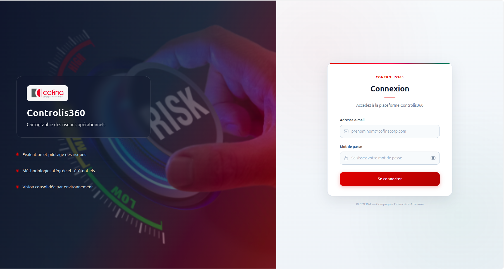

*Figure 1 — Écran de connexion Controlis360*

> **Astuce :** en cas d’échec (identifiants incorrects, compte inactif), un message d’erreur s’affiche sous le formulaire.

### 2.2 Premier changement de mot de passe

À la création du compte (ou après réinitialisation), un **changement de mot de passe** peut être exigé :

1. Saisir le mot de passe actuel.
2. Choisir un **nouveau mot de passe** (au moins 8 caractères) et le confirmer.
3. Cliquer sur **Enregistrer et continuer**.

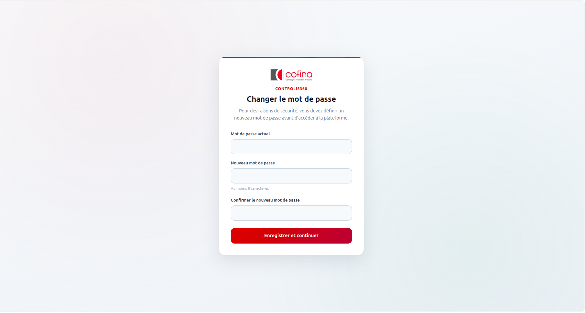

*Figure 2 — Changement de mot de passe à la première connexion*

Vous êtes ensuite redirigé vers le **portail**.

### 2.3 Déconnexion

- Bouton **Déconnexion** en bas de la barre latérale.
- **Inactivité** : après environ **2 heures** sans activité, la session se ferme automatiquement.

---

## 3. Portail et modules

Après connexion, l’écran **Controlis360** propose :

> *Sélectionnez un module pour continuer*

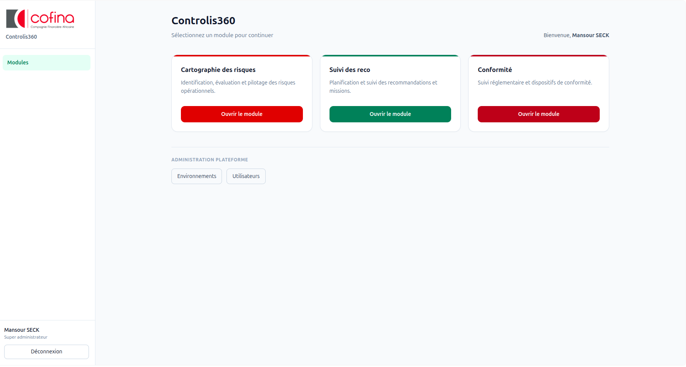

*Figure 3 — Portail Controlis360 : choix du module*

- Chaque carte accessible affiche **Ouvrir le module**.
- Seuls les modules autorisés pour votre compte apparaissent.
- Lien **← Tous les modules** (barre latérale) pour revenir au portail.

---

## 4. Profils et droits

### 4.1 Profils plateforme

| Profil | Rôle principal |
|--------|----------------|
| **Administrateur** | Gestion du périmètre (environnements / utilisateurs rattachés) |
| **Superviseur** | Consultation / validation cartographie |
| **Régulateur** | Avis sur les recommandations transmises |
| **Contrôle** | Cartographie + missions de contrôle |
| **Audit** | Missions d’audit et recommandations |
| **Métier** | Réponses aux reco / phase 2 risques |

Un utilisateur peut avoir des **profils différents par module**.

### 4.2 Sous-rôles utiles

| Module / profil | Sous-rôle | Capacités typiques |
|-----------------|-----------|--------------------|
| Contrôle | **Agent du contrôle interne** | Saisir et soumettre des lignes de risques |
| Contrôle | **Responsable Contrôle permanent…** | Valider les soumissions, éditer la méthodologie |
| Audit | **Agent / Responsable audit** | Créer et suivre missions / recommandations |
| Métier | **Responsable entité** | Phase 2 risques, répondre aux reco |
| Métier | **Agent** | Plan d’action affecté |
| Métier | **Groupe** / **Visiteur** | Consultation limitée |

### 4.3 Qui peut faire quoi (synthèse)

| Action | Qui |
|--------|-----|
| Créer une mission / paramétrer | Admin, Contrôle, Audit |
| Saisir une ligne de risque | Admin, Agent / Resp. contrôle |
| Valider soumission agent | Responsable contrôle |
| Compléter phase 2 | Responsable entité |
| Transmettre au régulateur | Contrôle, Audit (+ admins) |
| Voir file **Régulateur** | Régulateur |

---

## 5. Module Cartographie des risques

### 5.1 Navigation

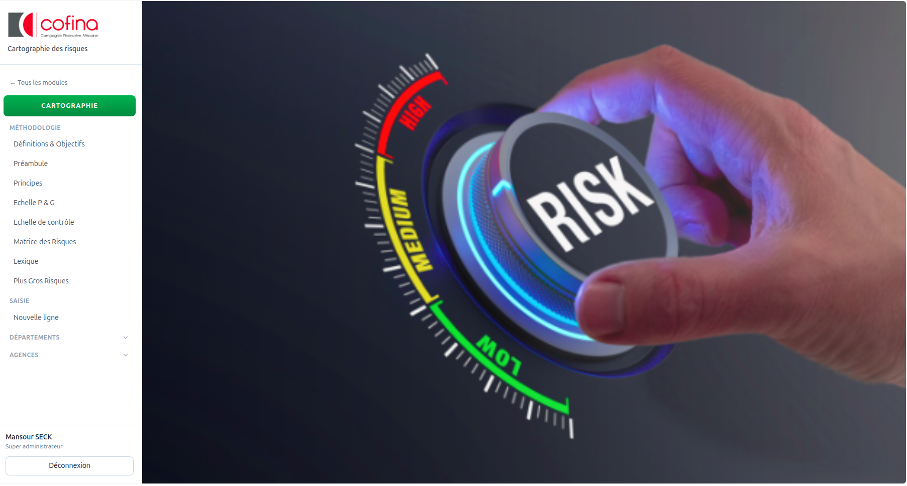

*Figure 4 — Barre latérale du module Cartographie des risques*

- **← Tous les modules**
- **Cartographie** — heatmaps
- **Méthodologie** (Définitions, Préambule, Principes, Échelles, Matrice, Lexique, Plus Gros Risques)
- **Saisie** → **Nouvelle ligne**
- **Départements** / **Agences**

### 5.2 Cartographie consolidée

Écran **CARTOGRAPHIE DES RISQUES** — vue consolidée des filiales.

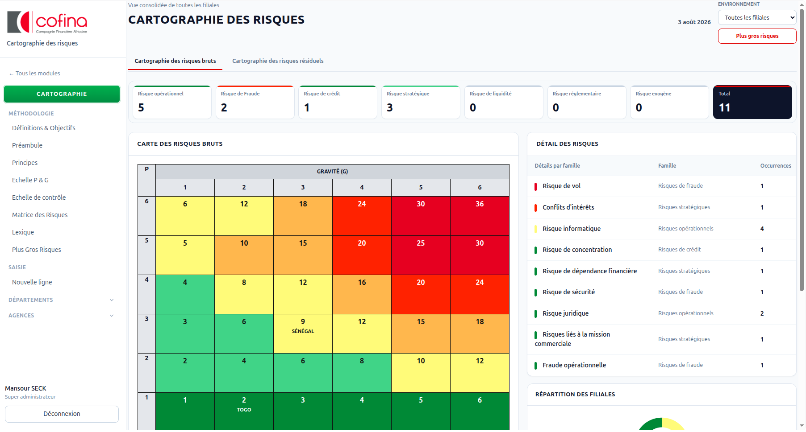

*Figure 5 — Vue consolidée : cartographie des risques*

**À retenir sur cet écran :**

- Filtre **environnement / filiale** (ex. « Toutes les filiales ») en haut à droite.
- Deux onglets : **Cartographie des risques bruts** et **Cartographie des risques résiduels**.
- Cartes de synthèse par famille de risque (opérationnel, fraude, crédit, etc.) et **total**.
- **Carte des risques** (heatmap) : axes **P** (probabilité) × **G** (gravité), cases colorées du vert (faible) au rouge (élevé) ; les filiales peuvent apparaître dans les cellules.
- Panneau **Détail des risques** à droite (libellés, familles, occurrences).
- Bouton **Plus gros risques** pour les risques à fort impact (Rb élevé, seuil usuel ≥ 20).

### 5.3 Méthodologie

Le menu **Méthodologie** regroupe les pages de référence : Définitions & Objectifs, Préambule, Principes, Échelle P & G, Échelle de contrôle, Matrice des Risques, Lexique, Plus Gros Risques.

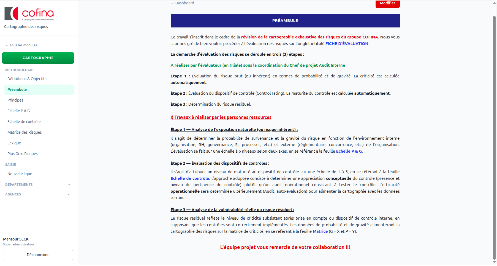

*Figure 6 — Référentiel méthodologique (ex. Préambule)*

**À retenir sur cet écran :**

- Ces pages expliquent **comment** évaluer les risques avant / pendant la saisie.
- Le **Préambule** (exemple ci-dessus) rappelle le processus en **3 étapes** :
  1. **Risque inhérent (brut)** — Gravité (G) et Probabilité (P) ;
  2. **Dispositifs de contrôle** — maturité / efficacité ;
  3. **Risque résiduel** — criticité restante après contrôles.
- Des liens renvoient vers les échelles et la matrice pour appliquer la méthode.
- L’édition de ces contenus est réservée aux profils autorisés (ex. responsable contrôle).

### 5.4 Saisie d’une ligne de risque (phase 1)

> **Qui peut le faire :** Agent contrôle, Responsable contrôle, Administrateur.

La **phase 1** décrit le risque **inhérent** (avant dispositifs de contrôle) : processus, libellé, Gravité (G), Probabilité (P), Risque brut (Rb).

1. **Saisie** → **Nouvelle ligne** (ou depuis l’analyse d’une entité).
2. Choisir l’**entité** (département ou agence).
3. Créer un **nouveau sous-processus** *ou* ajouter un risque sur un sous-processus existant.
4. Renseigner catégorie / famille, libellé du risque, **G**, **P** → le **Rb** est calculé.
5. **Enregistrer** → statut **Brouillon**.

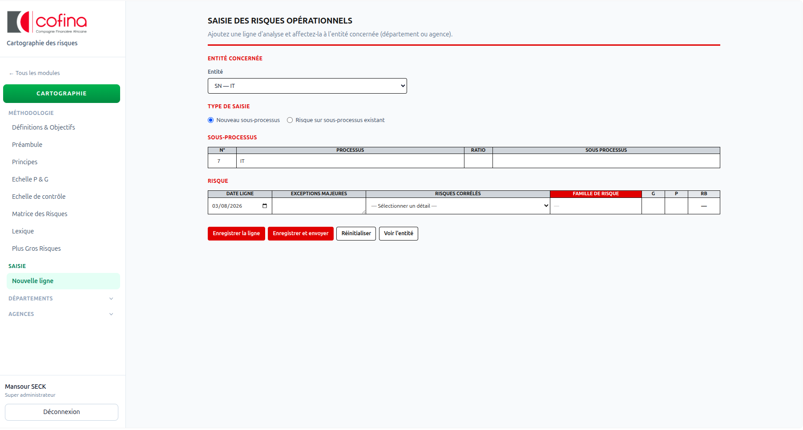

*Figure 7 — Saisie d’une nouvelle ligne de risque opérationnel*

> Tant que la ligne est en **Brouillon** (ou **Modifications demandées**), l’agent peut la modifier puis la **soumettre**.

### 5.5 Circuit de validation (vue d’ensemble)

Deux phases successives :

| Phase | Contenu | Acteur principal |
|-------|---------|------------------|
| **Phase 1** | Risque inhérent (G, P, Rb) | Agent / Responsable contrôle |
| **Phase 2** | Dispositifs de contrôle, efficacité, risque résiduel (Rr) | Responsable d’entité |

> **Circuit :** Agent → Soumettre → Responsable contrôle → Valider → Responsable entité (phase 2) → Finaliser

*(En cas de correction : le responsable contrôle peut **Renvoyer** → l’agent corrige → Soumettre à nouveau.)*

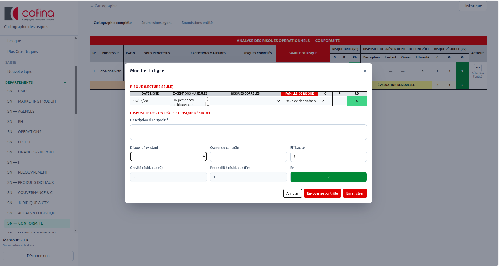

*Figure 8 — Analyse d’entité : cartographie et soumissions*

**Onglets utiles dans l’analyse :** Cartographie complète | Soumissions agent | Soumissions entité.

Le détail pas à pas (statuts, boutons, qui fait quoi) est dans la [section 7.1](#71-workflow-cartographie-des-risques).

### 5.6 Dashboards entité et Plus gros risques

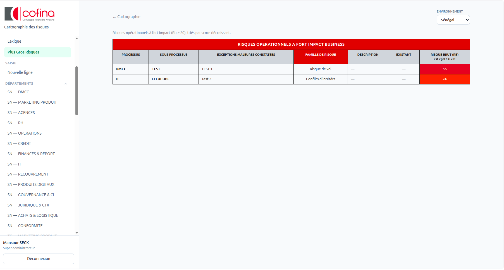

*Figure 9 — Risques opérationnels à fort impact business*

---

## 6. Module Suivi des reco

### 6.1 Navigation

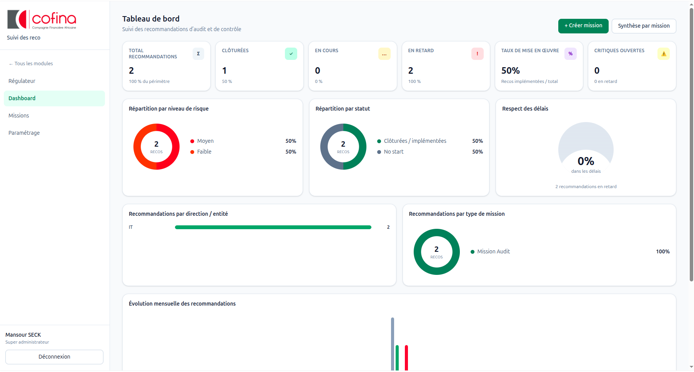

*Figure 10 — Barre latérale Suivi des reco*

- **Régulateur** | **Dashboard** | **Missions** | **Paramétrage**

> Le profil **Régulateur** a une navigation réduite (file régulateur uniquement).

### 6.2 Tableau de bord

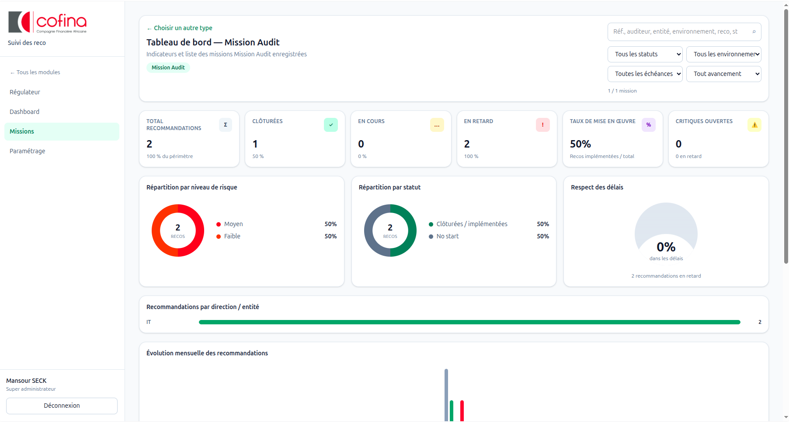

*Figure 11 — Tableau de bord : KPI et graphiques de suivi*

- KPI : total, clôturées, en cours, en retard, taux de mise en œuvre, critiques
- Boutons : **+ Créer mission**, **Synthèse par mission**

### 6.3 Créer une mission

> **Qui peut le faire :** Contrôle, Audit, Administrateur.

**Enchaînement global du module :**

> Créer mission → Ajouter recommandation(s) → Métier répond (Action / Affecter) → Audit/Contrôle suit → (optionnel) Transmettre au Régulateur → Clôture

1. **+ Créer mission**
2. **Identification** — référence, type, environnement
3. **Périmètre** — entités + **missionnaires**
4. **Calendrier** — dates
5. **Documents** — pièces jointes
6. Enregistrer → détail mission (statut mission souvent **Ouvert**)

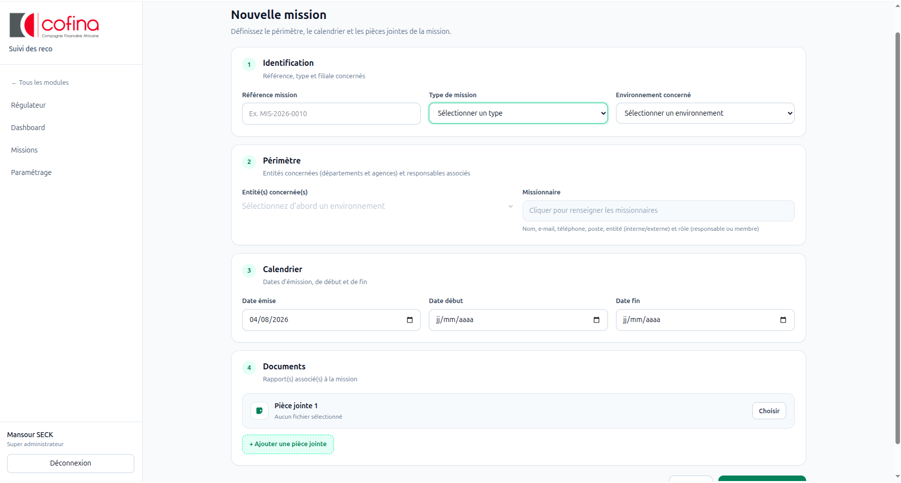

*Figure 12 — Création d’une mission (identification / périmètre)*

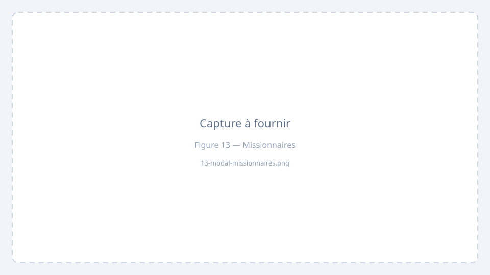

*Figure 13 — Missionnaires : Interne/Externe et rôle Responsable ou Membre*

> **Important :** le champ **Rôle dans la mission** indique si la personne est **Responsable** ou simple **Membre** de la mission (pas le nom d’une équipe externe).

### 6.4 Recommandations et réponse métier

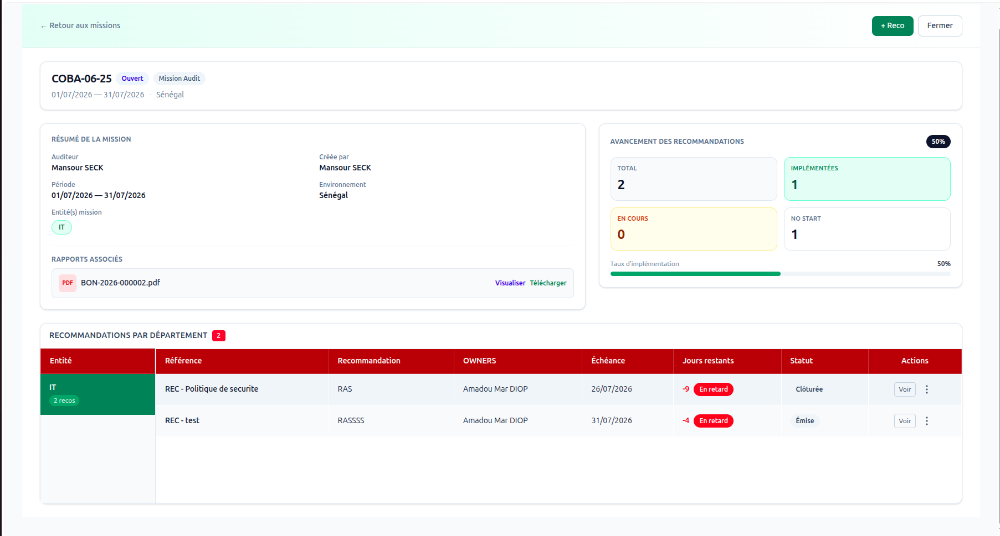

*Figure 14 — Détail mission et accès aux recommandations*

**Côté Audit / Contrôle — émettre une reco :**

1. Ouvrir la mission → **+ Reco**
2. Référence, priorité, niveau de risque, owners, dates, libellé…
3. Enregistrer (statut typique : **Émise**)

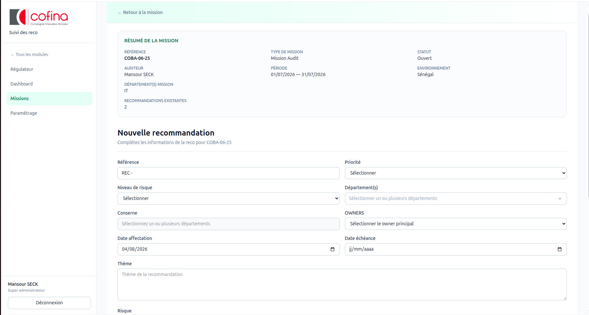

*Figure 15 — Formulaire de création d’une recommandation*

**Côté métier (owner) — traiter la reco :**

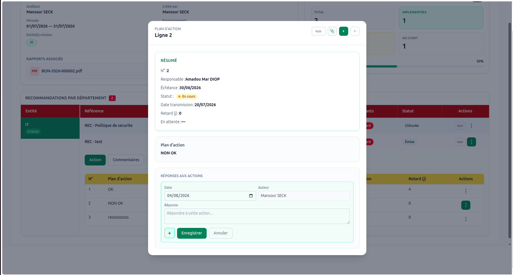

*Figure 16 — Réponse métier : action, affectation, plan d’action*

1. Ouvrir la recommandation.
2. Onglet **Affecter** (si proposé) :
   - **Traiter moi-même** — le responsable entité remplit le plan d’action ;
   - **Affecter à un membre** — un agent saisit, le responsable valide avant envoi.
3. Onglet **Action** : renseigner le **plan d’action** (lignes d’actions, échéances, responsables).
4. Ajouter **Commentaires** / **Pièces justificatives** si besoin.
5. Soumettre / transmettre selon le workflow affiché (**En saisie** → **À valider** → **Transmis**).

> Alternative : déclarer une **passivité** (motif + pièces) lorsque aucune action n’est engagée — selon les droits et le contexte mission.

**Côté Audit / Contrôle — après réponse :**

- Suivre l’avancement des plans d’action.
- **Transmettre** au régulateur lorsque le dossier est prêt.

Le détail complet est dans la [section 7.2](#72-workflow-suivi-des-recommandations).

### 6.5 File régulateur

Les reco n’apparaissent **qu’après** le bouton **Transmettre**. Voir [section 7.3](#73-workflow-régulateur).

### 6.6 Paramétrage

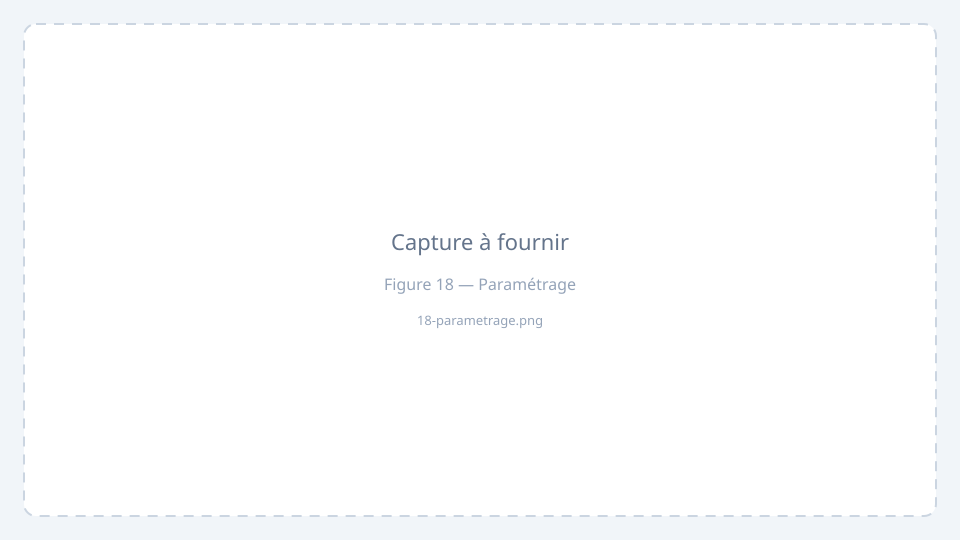

*Figure 18 — Types de mission et couleurs / statuts*

---

## 7. Workflows détaillés (pas à pas)

Cette section décrit **qui fait quoi**, **dans quel ordre**, et **quel statut** apparaît à l’écran.

### 7.1 Workflow Cartographie des risques

> **Circuit :** Agent → Soumettre → Responsable contrôle → Valider → Responsable entité (phase 2) → Finaliser

#### Objectif

Passer d’une idée de risque saisie par le contrôle à un risque **complété** avec évaluation du dispositif (phase 2) côté métier.

#### Acteurs

| Acteur | Rôle dans le circuit |
|--------|----------------------|
| **Agent contrôle** | Crée / corrige la phase 1, soumet |
| **Responsable contrôle** | Valide ou renvoie la phase 1 ; valide ou renvoie la phase 2 ; peut aussi corriger une soumission agent |
| **Responsable entité** | Complète la phase 2 (dispositifs, efficacité, Rr) et soumet |

#### Étape A — Saisie (Agent)

1. Ouvrir **Cartographie** → **Saisie** → **Nouvelle ligne** (ou l’entité dans Départements / Agences).
2. Choisir l’entité, le sous-processus, renseigner G / P / libellé.
3. **Enregistrer** → statut **Brouillon**.
4. Quand la fiche est prête : **Soumettre** → statut **En attente de validation**.

> Tant que le statut est **Brouillon** ou **Modifications demandées**, l’agent peut encore modifier puis resoumettre.

#### Étape B — Validation contrôle (Responsable contrôle)

Dans l’analyse d’entité, onglet **Soumissions agent** (ou menu ⋯ sur la ligne) :

| Action | Nouveau statut | Signification |
|--------|----------------|---------------|
| **Valider** | **Affecté à l’entité** | La phase 1 est acceptée ; l’entité doit faire la phase 2 |
| **Renvoyer à l’agent** / **Modifications** | **Modifications demandées** | L’agent doit corriger puis resoumettre |
| **Modifier** | (reste soumis / selon cas) | Correction directe possible pour le responsable contrôle sur une ligne soumise |

Une échéance peut être demandée à la validation.

#### Étape C — Phase 2 métier (Responsable entité)

Sur les lignes au statut **Affecté à l’entité** :

1. Ouvrir la ligne / compléter le formulaire phase 2 :
   - dispositifs de contrôle existants ;
   - efficacité / niveau de maîtrise ;
   - éléments permettant le **risque résiduel (Rr)**.
2. Enregistrer les brouillons de phase 2 si besoin.
3. **Soumettre** (entité) → statut **Soumis par l’entité**.

#### Étape D — Clôture contrôle

Onglet **Soumissions entité** :

| Action | Nouveau statut |
|--------|----------------|
| **Valider** / finaliser | **Complété** |
| **Renvoyer à l’entité** | Retour à **Affecté à l’entité** pour correction |

#### Tableau récapitulatif des statuts

| Statut affiché | Qui agit ensuite |
|----------------|------------------|
| Brouillon | Agent (ou créateur) |
| En attente de validation | Responsable contrôle |
| Modifications demandées | Agent |
| Affecté à l’entité | Responsable entité |
| Soumis par l’entité | Responsable contrôle |
| Complété | Terminé (consultation / reporting) |

#### Points d’attention

- Ne pas soumettre une ligne incomplète (libellé, G, P).
- Le responsable entité ne voit en principe que les lignes déjà **affectées** (pas les brouillons agent).
- Les heatmaps et **Plus gros risques** se basent sur les données validées / consolidées (Rb élevé, seuil usuel ≥ 20).

---

### 7.2 Workflow Suivi des recommandations

#### Objectif

Créer une mission, émettre des recommandations, obtenir une réponse métier (plan d’action), puis éventuellement transmettre au régulateur.

#### Vue d’ensemble

> Créer mission → Ajouter recommandation(s) → Métier répond (Action / Affecter) → Audit/Contrôle suit → (optionnel) Transmettre au Régulateur → Clôture

#### Étape 1 — Créer la mission

**Acteur :** Audit, Contrôle, Administrateur.

1. Dashboard → **+ Créer mission**.
2. Renseigner type, environnement, entités, missionnaires (Responsable / Membre), dates, documents.
3. Enregistrer → mission **Ouverte**.

#### Étape 2 — Émettre une recommandation

**Acteur :** profil autorisé à ajouter une reco sur la mission.

1. Détail mission → **+ Reco**.
2. Remplir référence, priorité, niveau de risque, owners, échéances, libellé, détails, PJ.
3. Enregistrer → reco **Émise** (ou statut choisi).

Les owners (responsables métier concernés) sont notifiés / voient la reco dans leur périmètre.

#### Étape 3 — Choisir comment traiter (métier)

**Acteur :** Responsable entité (owner).

Onglet **Affecter** :

| Choix | Suite |
|-------|--------|
| **Traiter moi-même** | Le responsable remplit le plan d’action (workflow **En saisie**) |
| **Affecter à un membre** | L’**agent** remplit le plan ; le responsable doit **valider** avant envoi (**À valider**) |

Sans ce choix, le plan d’action n’est en général pas accessible.

#### Étape 4 — Remplir le plan d’action

**Acteur :** Responsable (mode self) ou Agent (mode affecté).

1. Onglet **Action** : ajouter les lignes du plan (action, responsable, échéance, statut).
2. Onglets **Commentaires** et **Pièces justificatives** si nécessaire.
3. Soumettre selon les boutons affichés :
   - Agent → envoi au responsable pour validation ;
   - Responsable → transmission vers Audit / Contrôle (**Transmis** côté réponse).

**Statuts du workflow de réponse :**

| Statut | Signification |
|--------|----------------|
| **En saisie** | Plan en cours de rédaction |
| **À valider** | L’agent a soumis ; le responsable doit valider |
| **Transmis** | Réponse envoyée à l’audit / au contrôle |

#### Étape 5 — Passivité (cas particulier)

Si aucune action n’est engagée, le métier peut déclarer une **passivité** :

1. Choisir le mode passivité (selon l’écran mission / reco).
2. Saisir le **motif** et joindre des pièces si demandé.
3. Envoyer → la réponse part en mode passivité (souvent directement **Transmis**).

#### Étape 6 — Suivi Audit / Contrôle

**Acteur :** Audit ou Contrôle.

1. Consulter la reco et la réponse / le plan d’action.
2. Échanger via commentaires si besoin.
3. Mettre à jour le statut de la reco (En cours, Traitée, etc.).
4. Quand le dossier est prêt : **Transmettre** au régulateur.

#### Étape 7 — Clôture

- Recommandation **Clôturée** lorsque le suivi est terminé.
- Mission **Fermée** lorsque toutes les reco sont soldées (selon pratique de l’équipe).

---

### 7.3 Workflow Régulateur

1. Audit / Contrôle clique **Transmettre** sur une recommandation éligible.
2. La reco apparaît dans le menu **Régulateur** (statut type **Transmis**).
3. Le régulateur ouvre le détail, consulte le dossier et peut commenter selon ses droits.
4. La clôture finale reste gérée selon le processus métier / audit.

> Sans étape **Transmettre**, le régulateur **ne voit pas** la recommandation.

---

### 7.4 Fiches « Qui fait quoi » (mémo rapide)

| Si je suis… | Mon parcours type |
|-------------|-------------------|
| **Agent contrôle** | Saisie → Brouillon → Soumettre → corriger si « Modifications demandées » |
| **Responsable contrôle** | Soumissions agent → Valider / Renvoyer → plus tard Soumissions entité → Compléter |
| **Responsable entité (carto)** | Lignes « Affecté à l’entité » → Phase 2 → Soumettre |
| **Audit / Contrôle (reco)** | Créer mission → + Reco → suivre plans → Transmettre régulateur |
| **Responsable entité (reco)** | Affecter (self ou agent) → Plan d’action → Transmettre à l’audit |
| **Agent métier** | Remplir le plan qui m’est affecté → soumettre au responsable |
| **Régulateur** | Menu Régulateur → consulter les dossiers transmis |

---

## 8. Glossaire et annexes

### 8.1 Glossaire cartographie

| Terme | Signification |
|-------|----------------|
| **G** | Gravité |
| **P** | Probabilité |
| **Rb** | Risque brut |
| **Rr** | Risque résiduel |
| **Pr** | Probabilité / efficacité liée au dispositif |
| **Sous-processus** | Découpage d’activité |
| **Fort impact** | Rb élevé (seuil usuel ≥ 20) |
| **Phase 1** | Évaluation du risque inhérent (contrôle) |
| **Phase 2** | Évaluation des dispositifs / risque résiduel (entité) |

### 8.2 Statuts — Cartographie

| Statut | Étape |
|--------|--------|
| Brouillon | Saisie agent |
| En attente de validation | Soumis au responsable contrôle |
| Modifications demandées | Retour agent |
| Affecté à l’entité | Phase 2 côté métier |
| Soumis par l’entité | Retour contrôle |
| Complété | Circuit terminé |

### 8.3 Statuts — Suivi des reco

| Objet | Statuts typiques |
|-------|------------------|
| Mission | Ouvert, Fermé |
| Recommandation | Émise, En cours, Traitée, Transmis, Clôturée |
| Réponse (workflow) | En saisie, À valider, Transmis |
| Plan d’action | Non démarré, En cours, En attente, En retard, Clôturé, Annulé |

### 8.4 Raccourcis

| Besoin | Chemin |
|--------|--------|
| Changer de module | ← Tous les modules |
| Créer une mission | Suivi des reco → Dashboard → + Créer mission |
| Saisir un risque | Cartographie → Saisie → Nouvelle ligne |
| Valider des soumissions | Cartographie → Département → Soumissions |

### 8.5 Bonnes pratiques

1. Vérifier **environnement** et **entités** avant de saisir.
2. Missionnaires : bien choisir **Responsable** ou **Membre**.
3. Cartographie : respecter l’ordre **Soumettre → Valider → Phase 2 → Compléter**.
4. Reco : toujours **Affecter** (self ou agent) avant de remplir le plan d’action.
5. Ne transmettre au régulateur que dossier prêt.
6. Se déconnecter sur poste partagé.

---

## Support

1. Vérifier profil / modules avec un administrateur.  
2. Vérifier le périmètre (environnement / entité).  
3. Contacter l’équipe Controlis360 / COFINA.

---

*Controlis360 — usage interne COFINA — version illustrée.*  
*Checklist des captures : `LISTE_CAPTURES.md` · Export PDF : `manuel-pdf.html`*
